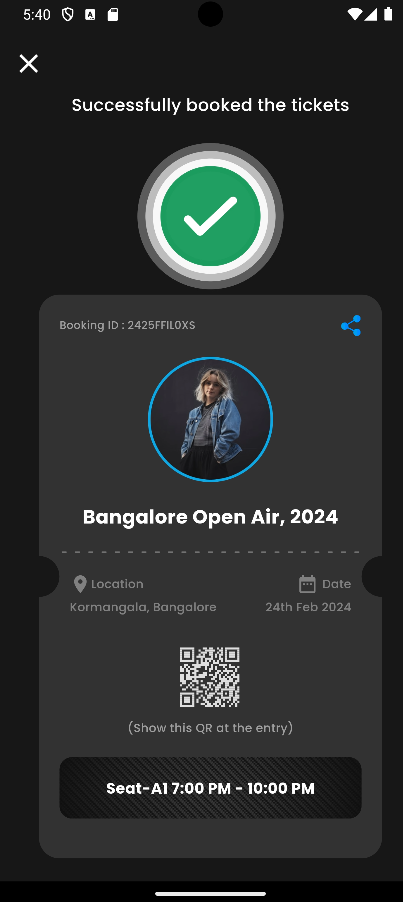
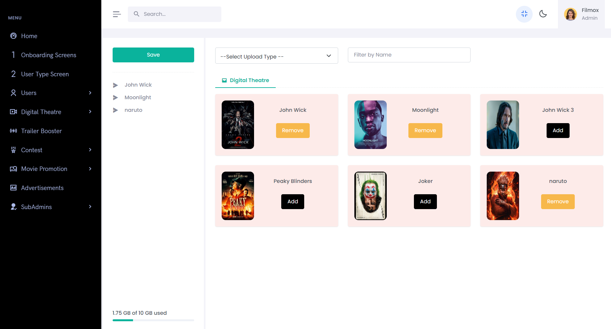

# 🎬 **FILMOX** - All-in-One Entertainment Social Platform

🎥**Filmox** is an innovative social media platform tailored for the film industry, serving as a dynamic hub for filmmakers, artists, actors, and film enthusiasts 🎭. 🌟 It offers a space where talents can be showcased, connections with like-minded individuals can flourish, and exciting opportunities in cinema can be discovered. 🌐✨

Whether you're an aspiring filmmaker looking for exposure 🎬 or an established production house seeking talent 🏆, **Filmox** fosters creative collaboration and industry networking, making it the perfect platform for the film community. 🤝🎉

## 📱 Mobile App Screenshots

<table style="border-collapse: collapse; width: 100%;">
  <tr>
    <td style="padding: 5px; text-align: center;">
      
    </td>
    <td style="padding: 5px; text-align: center;">
      
    </td>
    <td style="padding: 5px; text-align: center;">
      
    </td>
    <td style="padding: 5px; text-align: center;">
      
    </td>
    <td style="padding: 5px; text-align: center;">
      
    </td>
    <td style="padding: 5px; text-align: center;">
      
    </td>
  </tr>
  <tr>
    <td style="padding: 5px; text-align: center;">
      
    </td>
    <td style="padding: 5px; text-align: center;">
      
    </td>
    <td style="padding: 5px; text-align: center;">
      
    </td>
    <td style="padding: 5px; text-align: center;">
      
    </td>
    <td style="padding: 5px; text-align: center;">
      
    </td>
    <td style="padding: 5px; text-align: center;">
      
    </td>
  </tr>
  <tr>
    <td style="padding: 5px; text-align: center;">
      
    </td>
    <td style="padding: 5px; text-align: center;">
      
    </td>
    <td style="padding: 5px; text-align: center;">
      
    </td>
    <td style="padding: 5px; text-align: center;">
      
    </td>
    <td style="padding: 5px; text-align: center;">
      
    </td>
    <td style="padding: 5px; text-align: center;">
      
    </td>
  </tr>
  <tr>
    <td style="padding: 5px; text-align: center;">
      
    </td>
    <td style="padding: 5px; text-align: center;">
      
    </td>
    <td style="padding: 5px; text-align: center;">
      
    </td>
    <td style="padding: 5px; text-align: center;">
      
    </td>
    <!-- <td style="padding: 5px; text-align: center;">
      
    </td>
    <td style="padding: 5px; text-align: center;">
      
    </td> -->
  </tr>
</table>

## 💻 Admin Panel Screenshots

<table style="border-collapse: collapse; width: 100%;">
  <tr>
    <td style="padding: 5px; text-align: center;">
      
    </td>
    <td style="padding: 5px; text-align: center;">
      
    </td>
  </tr>
  <tr>
    <td style="padding: 5px; text-align: center;">
      
    </td>
    <td style="padding: 5px; text-align: center;">
      
    </td>
  </tr>
  <tr>
    <td style="padding: 5px; text-align: center;">
      
    </td>
    <td style="padding: 5px; text-align: center;">
      
    </td>
  </tr>
  <tr>
    <td style="padding: 5px; text-align: center;">
      
    </td>
    <td style="padding: 5px; text-align: center;">
      
    </td>
  </tr>
</table>

<!-- ## 🎥 Live Demos

- [Mobile App Demo](https://youtu.be/your-demo-link)
- [Desktop App Demo](https://youtu.be/your-demo-link) -->

---

> "I don't want to bore you with all the details, but here's a quick peek at what Filmox can do for you!" 😉

### ✨ **Key Features:**

- **User Registration & Login**:  
  Easy sign-up for film professionals to join the community and showcase their work. 🎥
- **Social Media Platform**:  
  Users can post creative content to showcase their talents and grow their audience. 🎞️

- **In-App Chat**:  
  Collaborate and network with industry professionals through direct messaging. 💬

- **Digital Theater**:  
  This OTT-like feature allows users to upload and share films or videos, reaching a broader audience. 🍿

- **Job Portal**:  
  Film-specific job board for roles such as acting, directing, and production. 🎬💼

- **Movie Promotions**:  
  Production houses can promote their films by submitting materials like posters, trailers, and teasers to the community. 🎥🌟

- **Advertising**:  
  Promote non-film-related products and services with ads and sponsored content. 📢

- **Production Services**:  
  Book filmmaking equipment and resources through a dedicated section. 🎥🎚️

- **Celebrity Panel**:  
  A private space for verified users to connect with celebrities. 🎤✨

- **Games**:  
  Engage in live games and events with industry figures such as celebrities. 🏏⚽

- **YouTube Direct Upload**:  
  Upload videos directly to Filmox's official YouTube channel. 🚀

- **Inquiry System**:  
  Send collaboration requests to celebrities and industry professionals. 📩

**Filmox** is your ultimate space for connecting, collaborating, and growing in the world of cinema! 🌍🎉

---

### 🔧 Tech Stack

- **Framework**: Flutter 🚀, Laravel 🛠️
- **Backend**: MySQL 💾
- **Platforms**: iOS 🍏, Android 🤖, Web 🌐

---

### 🤔 Want to Check Out the App?

If you're interested in seeing the app, please download the APK and register to get started! 📲

---

## 🌟 Get in Touch

If you like the project or have feedback, feel free to reach out or star the repo!
